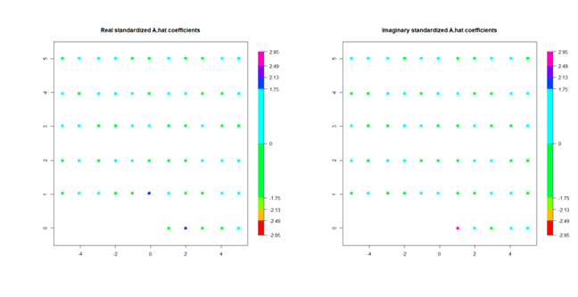
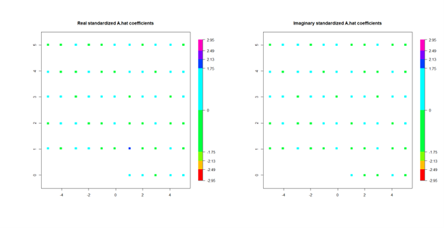
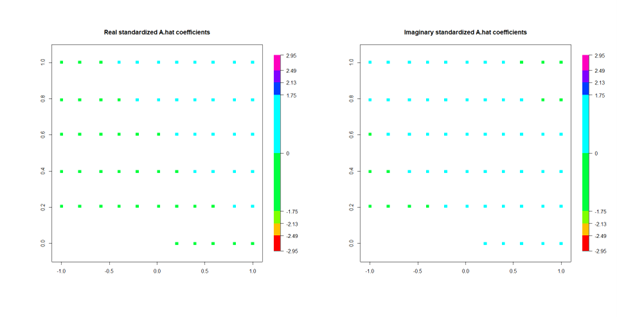
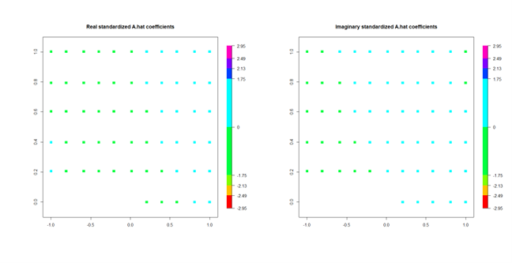
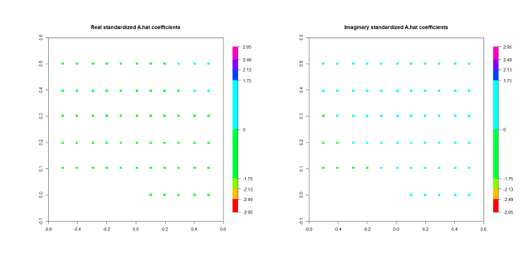
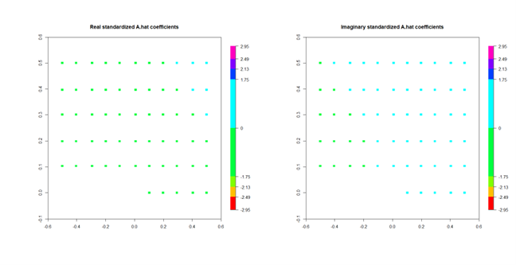

---
# UNL thesis fields
title: "STATISTICAL TESTING OF ACTIVITY CLIFFS"
author: "Sarah Josephine Aurit"
month: "December"
year: "2023"
location: "Lincoln, Nebraska"
major: "Statistics"
adviser: "Souparno Ghosh"
abstract: |
  Here is my abstract. *(350 word limit)*
acknowledgments: |
  I am grateful for this second opportunity from the University of Nebraska-Lincoln to pursue further education. I am more appreciative of the academic journey, which includes meeting so many new and inspiring individuals including my fellow students, professors, and advisor and exposure to new and cutting edge content to sharpen my statistical skillset. The journey mirrored other aspects of life in which I had to discover that with enough hard work that many things are possible, and that I still have a contribution to make within multiple realms of life. 

  Thank you Dr. Stroup for giving me the confidence to continue moving forward in the work. Dr. Eskridge you were an inspiration and I learned so much from you. Dr. Ghosh, thank you for taking me on when you already had so many students.  

  To my most beloved children, you are cherished beyond words and I hope this endeavour proves fruitful for us as a family in the years to come. You were patient with me, and I hope that I have shown you a small portion of what is possible in your own life.

dedication: |
  Dedicated to...
# End of UNL thesis fields
knit: "bookdown::render_book"
site: bookdown::bookdown_site
output: 
  bookdown::pdf_book:
    pandoc_args: --top-level-division=chapter
    keep_tex: yes
    latex_engine: xelatex
    template: template.tex
  huskydown::thesis_gitbook: 
    style: style.css
#  huskydown::thesis_word: default
#  huskydown::thesis_epub: default
bibliography: bib/thesis.bib
# Download your specific bibliography database file and refer to it in the line above.
csl: bib/apa.csl
# Download your specific csl file and refer to it in the line above.
lot: true
lof: true
#header-includes:
#- \usepackage{tikz}
---

```{r setup, include = F}
options(width = 60)
knitr::opts_chunk$set(
  echo = F, 
  eval = T, 
  messages = F, 
  warnings = F,
  fig.width = 6, 
  fig.height = 4,  
  fig.align = 'center',
  out.width = "\\linewidth", 
  dpi = 300, 
  tidy = T, tidy.opts=list(width.cutoff=45),
  fig.pos = "tbp",
  out.extra = "",
  cache = FALSE
)
```

```{r include_packages, include = FALSE}
# This chunk ensures that the huskydown package is
# installed and loaded. This huskydown package includes
# the template files for the thesis.
if(!require(devtools))
  install.packages("devtools", 
                   repos = "http://cran.rstudio.com")
if(!require(huskydown))
  devtools::install_github(
    "benmarwick/huskydown"
  )
library(huskydown)
library(tidyverse)
library(knitr)
library(ggplot2)
library(formatR)
```

# Literature Review

## Motivation and Background

The journey of discovering effective cancer drugs can be long and expensive. The elements of time and cost weigh against the race to improve survival and the quality of life for cancer patients. Researchers typically start testing drug compounds on cancer cell lines within a laboratory setting first before testing on animals or humans. To narrow the search field, drugs are sometimes pursued that are similar to ones previously found to be successful in cancer treatment. That said, it is possible for the similar drug to be much less effective, which is defined as an activity cliff (AC) (Cruz-Monteagudo et al., 2014).

According to HU et al. (2017), compounds that are structurally similar yet have large potency differences are identified as producing activity cliffs upon an activity landscape. Additionally, an activity cliff is potentially produced within the context of the following four key aspects: 1) we are considering and comparing a pair of compounds, 2) both compounds are active against the same target, 3) the two compounds are similar in chemical structure, and 4) there is a difference in potency.

Focusing on the aspect of compound similarity via cheminformatics, formal investigation is completed by looking at similarity measurements. There are multiple approaches regarding the quantification of similarity between two compounds. One popular selection is the Tanimoto coefficient.

The Tanimoto coefficient, a measure of similarity, is determined by the quantification of molecular attributes that are similar between two molecular compounds. Essentially, it is a ratio of the number of similar entities divided by the total number of molecular attributes. (Reference: Why is Tanimoto index an appropriate choice for fingerprint-based similarity calculations?)

Analogously, matched molecular pairs (MMP) analysis encompasses another measurement of similarity. Essentially, two molecules differ by one "well-defined, structural" chemical transformation. (Reference: https://pubs-acs-org.libproxy.unl.edu/doi/pdf/10.1021/jm200452d). MMPs were initially used as a special case of a quantitative structure-activity relationship (QSAR), which relates molecular compounds to the response of potency or other biochemical properties.

QSAR methodology can be essential in determining the relationships between chemical structures and biochemical activities, and it is typical that the methodology incorporates supervised machine learning techniques. Compounds are first represented by a numerical entity such as a two-dimensional structural formula that promulgates atom connectivity via chemical bonds. The structural formula then is related to bioactivities. It is not uncommon for there to be violations of QSAR methodology given the presence of an AC. (Reference: QSAR modeling where have you been where are you going)

## GDSC Dataset

The Genomics of Drug Sensitivity in Cancer (GDSC) database was instituted by the UK's Wellcome Sanger Institute's Cancer Genome Project and Massachusetts General Hospital's Center for Molecular Therapeutics. It is a repository and compilation of anti-cancer drug response information for more than 100 drugs linked to almost 700 cancer cell lines of multiple primary cancer sites for a total of approximately 75,000 experiments. Fluorescence-based assays were obtained after 72 hours had elapsed to measure drug sensitivity for each experiment. The response was quantified by $IC_\text{50}$, a metric that reveals how much substance or dose is necessary to inhibit a biological component by 50%. Additionally, the slope of the dose-response curve fitted to nine drug concentrations and area under the curve (AUC) were reported as additional measures of sensitivity (Reference: Genomics of Drug Sensitivity in Cancer: A Resource for Therapeutic Biomarker Discovery in Cancer Cells). 

We focus on breast cancer data, which is populated by data linked to over 200 drugs. Disregarding missing data, approximately 900 drug characteristics were identified for each drug alongside the mean values of the log of $IC_\text{50}$ values.

## Transformation

Dimension reduction is a critical element in the investigation of these breast cancer drugs because of the high dimensionality of drug characteristics relative to the number of drugs. Classical techniques such as principal component analysis (PCA) and multidimensional scaling (MDS) rely on the assumptions that fail within the context of non-linear structures that are intrinsic to some datasets. An alternative dimension reduction technique is that of isometric feature mapping (isomap). <https://wearables.cc.gatech.edu/paper_of_week/isomap.pdf> The algorithm is comprised of three steps. First, Euclidean distances are calculated at each point for all other points that are either within a specific radius or are considered a $K$ nearest neighbors ($k$NN), which are utilized to construct a distance matrix. Next, all pairwise distances are calculated and the shortest path is selected by Dijkstra's (shortest pathway from one node to another while navigating intermediary nodes) or Floyd-Warshall algorithm. 

Large Margin Nearest Neighbor (LMNN) was a subsequent methodology to promote improvement of grouping like drug responses. LMNN allows for learning more appropriate distances via transformation of the two dimensional coordinates obtained from the isomap dimension reduction technique.  

## Stationarity for Irregularly Spaced Data

We can consider the investigation of drug efficacy over molecular space within the context of spatial statistics. Commonly, assumptions surrounding spatial data include that of second-order stationarity to make accurate predictions. We consider drug efficacy as a random variable for each known position within molecular space. The first requirement for second-order stationarity is that the expectation and variance of drug efficacy is constant over the entire domain of molecular space. An additional requirement is that the covariance between any two observations only relies on the distance between the two observations. We denote a spatial process in $d$ dimensions, and where $\textbf{s}$ is the location in two dimensions post-dimension reduction. Also, let $Z(\textbf{s})$ be the realization of a process, and let $Z(\textbf{s})$ be a random variable, which is indexed by its location $\textbf{s} \in R^\text{2}$. We can then define constant expectation and covariance over the domain of molecular space:

```{=tex}
\begin{equation}
  E[Z(\textbf{s})]=\mu 
\end{equation} \begin{equation}
  cov[{Z(\textbf{s}_\text1),Z(\textbf{s}_\text2)}]=c(\textbf{s}_\text1, \textbf{s}_\text2) 
\end{equation}
```

Bandyopadhyya and Rao (2017), proposed a test for second order stationarity for irregularly spaced data for the region $[-\lambda/2, \lambda/2]^\text{2}$ assuming the locations are independent and uniformly distributed random variables. An adaptation of the classical discrete Fourier transforms (DFTs) of a time series for a spatial random field is as follows for $(\textbf{s}_j,Z(\textbf{s}_j); j = 1,...,n)$ observations:

```{=tex}
\begin{equation}
  J_n(\boldsymbol{\omega})=\frac{\lambda^{d/2}}{n}\sum_{j=1}^{n}Z(\textbf{s}_j)exp(i\textbf{s}_j'\boldsymbol{\omega}) 
\end{equation}
```

Given the fact that we have locations of points within a grid of two dimensions, the equation simplifies to:

```{=tex}
\begin{equation}
  J_n(\omega_k)=\frac{\lambda}{n}\sum_{j=1}^{n}Z(s_{j_1}, s_{j_2})\omega_k 
\end{equation}
```

With $2\pi$ periodicity (in each dimension?), the fundamental frequency is $2\pi/\lambda$. The aggregation of terms incorporates frequencies $\omega_k = exp[\frac{2\pi i}{\lambda}(s_{j_1}k_1+s_{j_2}k_2)]$ to transform the sequence of $Z(s_j)$ observations to the DFTs where i is $\sqrt{-1}$. In matrix form:

```{=tex}
\begin{equation}
  J_n(\omega) = \frac{\lambda}{n}
 \begin{bmatrix}
    1 & 1 & 1 & \cdots & 1 \\
    1 & \omega_k & \omega_k^2 & \cdots & \omega_k^{(n-1)} \\
    1 & \omega_k^2 & \omega_k^4 & \cdots & \omega_k^{2(n-1)} \\
    \vdots \\
    1 & \omega_k^{(n-1)} & \omega_k^{2(n-1)} & \cdots & \omega_k^{(n-1)(n-1)} 
  \end{bmatrix}
  \begin{bmatrix}
      \hat{Z(s_{1_1}, s_{1_2})} \\
      \hat{Z(s_{2_1}, s_{2_2})} \\
      \hat{Z(s_{3_1}, s_{3_2})} \\
      \vdots \\
      \hat{Z(s_{n_1}, s_{n_2})}
  \end{bmatrix}
\end{equation}
```

In order to examine stationarity vs. non-stationarity, we construct a test statistic to investigate the null hypothesis that the spatial field is second-order stationary as opposed to non-stationary (observed - expected?). The first component of the statistic is the measurement of covariance between the DFTs and a lag $r$:

```{=tex}
\begin{equation}
\begin{split}
  \hat{A}_\lambda(g;r)&=\frac{1}{\lambda^{d}}\sum_{k_1,\cdots,k_d=-a}^{a}g(\omega_k)J_n(\omega_k)\overline{J_n(\omega_{k+r})}\\
  &-\frac{1}{n}\sum_{k_1,...,k_d=-a}^{a}g(\omega_k) x \frac{1}{n}\sum_{j=1}^{n}Z(s_j)^2exp(-is'_j\omega_r)
\end{split}
\end{equation}
```

where $g$ is a Lipschitz continuous function. The test statistic is then constructed from this as follows to reflect:

```{=tex}
\begin{equation}
  T_S=\frac{\lambda^d max_{\left(r \epsilon S\right)}{\left\lvert\hat{A}_\lambda\left(g;r\right) \right\rvert}^2} {c_{\left(\lambda,1\right)}}
\end{equation}
```

where $S$ is a finite set that surrounds the origin, and $S \cap S' =\emptyset$.

The estimation of $c_{\lambda,1}$ that estimates variance is as follows: 

```{=tex}
\begin{equation}
  \hat{c}_{\lambda}(S')=\frac{\lambda^d}{2|S'|-1}\sum_{r \epsilon S'}[({\mathscr{R} \hat{A}_\lambda(g;r)-\overline{A}})^2+({\mathscr{I} \hat{A}_\lambda(g;r)-\overline{A}})^2]
\end{equation}
```

where $S' \epsilon Z^d/ \{0\}$ and $\overline{A}={{1/2|S'|}}\sum_{r \epsilon S'}({\mathscr{R} \hat{A}_\lambda(g;r)+\mathscr{I} \hat{A}_\lambda(g;r)})$. It is intuitive to think that When lag $r$ that is close to zero, the coefficients $\hat{A}$ have similar variance.

We investigate second-order stationarity for the GDSC data consisting of 208 drugs applied to breast cancer cell lines and the response of log$IC_\text{50}$. We initially employ three scenarios that differ based on lambda value ($\lambda = 1, 2, and 10$ with a consistent grid pattern in that there are the same number of total grid elements with $k_1 , k_2$ incrementally indexed by a factor of ten. For each scenario, we look at the data before and after transformation in conjunction with each of the three scenarios and present the T test statistic and associated p-values.

## Results

We recognize a distinct pattern change in the comparison of pre- and post-transformation coordinates and associated outcome values for the largest two-dimensional grid space (Figures 1.1 and 1.2). For all positive coordinates and before transformation, we see evidence of $\mathscr{R} \hat{A}_\lambda$ and $\mathscr{I} \hat{A}_\lambda$ values associated with statistical significance (the real and imaginary $\hat{A}_\lambda$ values comprise the numerator of the global test statistic). The count of $\mathscr{R} \hat{A}_\lambda$ and $\mathscr{I} \hat{A}_\lambda$ values that fall outside of the interval [-1.75, 1.75] when considering a $t$-distribution with 15? degrees of freedom (could include a graphic that showcases the appropriate degrees of freedom S and S') decrease from three to one from pre- to post-transformation. Additionally, the pre-transformation test statistic and associated $P$-value (T=8.49; $P$=0.125) also differs from the post-transformation test statistic and $P$-value (T=3.85; $P$=0.508). We assume a Gaussian process with exponential covariance. 

```{r echo=FALSE, fig.cap = "Pre-Transformation; $\\lambda=10$"}

```

```{r echo=FALSE, fig.cap = "Post-Transformation; $\\lambda=10$"}

```

As we zoom in, all statistical evidence of non-stationarity is eliminated, and there are no further indication that $\mathscr{R} \hat{A}_\lambda$ and $\mathscr{I} \hat{A}_\lambda$ values fall outside the interval [-1.75, 1.75].

```{r echo=FALSE, fig.cap = "Pre-Transformation; $\\lambda=2$"}

```

```{r echo=FALSE, fig.cap = "Post-Transformation; $\\lambda=2$"}

```

```{r echo=FALSE, fig.cap = "Pre-Transformation; $\\lambda=1$"}

```

```{r echo=FALSE, fig.cap = "Post-Transformation; $\\lambda=1$"}

```

With similar degrees of freedom, the pre- and post-transformation test statistic and associated $P$-values when $\lambda=2$ (Pre-Transformation: T=2.06; $P$=0.808 and Post-Transformation: T=2.56; $P$=0.727) and $\lambda=1$ (Pre-Transformation: T=2.19; $P$=0.795 and Post-Transformation: T=2.36; $P$=0.764) are all scenarios that show statistical evidence of second-order stationarity. Upon examination of the plots of the real and imaginary components on the positive points of the grid, we see confirmation that stationarity is present. 

## Discussion and Conclusion

The investigation of second order stationarity is relevant when considering the potential of an activity cliff. We hypothesize that an AC will be associated with statistical evidence of a violation of second-order stationarity.


